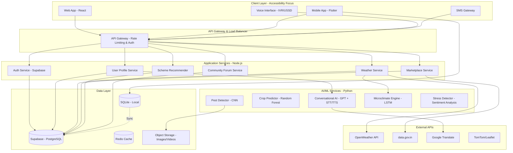
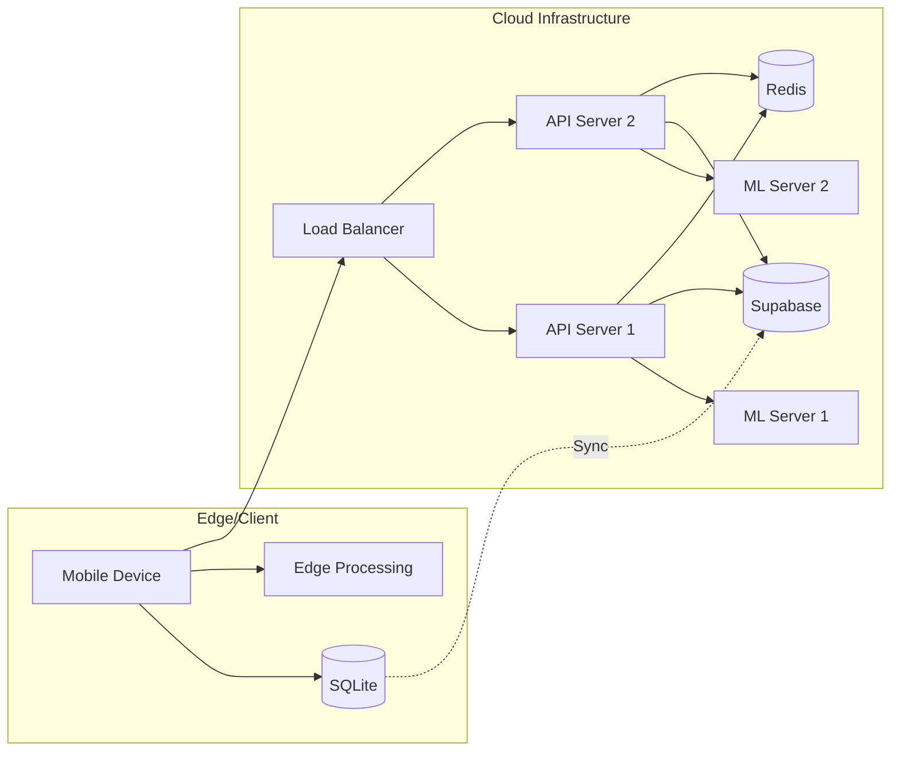

# Design Document: AI-Powered Agricultural Advisory Platform

## Overview

The AI-Powered Agricultural Advisory Platform is designed as a **community-first, accessibility-focused** system that democratizes agricultural knowledge and resources for underserved farming communities. The platform architecture prioritizes **voice-first interaction**, **low-bandwidth operation**, **offline-first data management**, and **multilingual support** to ensure inclusion regardless of literacy, language, or connectivity barriers.

### Core Design Principles

1. **Accessibility First**: Voice-based interfaces, multilingual support, and simple visual design for varying literacy levels
2. **Offline-First Architecture**: Local data storage with background synchronization to function in low-connectivity environments
3. **Low-Bandwidth Optimization**: Compressed data formats, progressive loading, and efficient API usage for 2G/3G networks
4. **Community-Centric**: Peer learning, knowledge sharing, and collective impact measurement
5. **Modular & Extensible**: Microservices architecture allowing independent scaling and feature additions
6. **Privacy & Security**: End-to-end encryption, role-based access, and compliance with data protection regulations

### Key Innovations

- **Hyperlocal Microclimate Engine**: Field-level (1km²) weather prediction using ML models trained on local weather station data
- **Voice-First Conversational AI**: STT → LLM → TTS pipeline optimized for 10 Indian regional languages with <10s latency
- **Offline-First Sync Pattern**: SQLite local cache with Supabase real-time sync using conflict resolution strategies
- **Visual Pest Detection**: CNN-based image classification achieving 85%+ accuracy with edge preprocessing
- **Agentic AI Advisory**: Context-aware recommendations that learn from farmer interactions and outcomes
- **Community Learning Network**: Peer-to-peer knowledge sharing with reputation-based expert identification

## Architecture

### High-Level System Architecture



### Deployment Architecture



## Components and Interfaces

### 1. Voice-First Conversational AI (Chatbot)

**Purpose**: Provide hands-free, multilingual agricultural advisory through natural conversation

**Architecture Pattern**: Modular STT → LLM → TTS Pipeline

**Components**:
- **Speech-to-Text (STT)**: Transcribe farmer voice input to text
- **Language Detection**: Identify spoken language from 10 supported regional languages
- **Context Manager**: Maintain conversation state, farmer profile, and farm history
- **LLM Processor**: Generate contextual responses using GPT API with agricultural knowledge base
- **Stress Detector**: Analyze sentiment and emotional indicators in conversation
- **Text-to-Speech (TTS)**: Convert response text to natural voice in farmer's language
- **Translation Layer**: Google Translate API for multilingual support

**Interface**:
```typescript
interface ChatbotService {
  // Process voice input and return voice response
  processVoiceQuery(
    audioInput: AudioBuffer,
    farmerId: string,
    sessionId: string
  ): Promise<{
    audioResponse: AudioBuffer;
    transcript: string;
    responseText: string;
    language: string;
    stressLevel: number; // 0-10 scale
    escalateToHuman: boolean;
  }>;
  
  // Process text input (for web/mobile text chat)
  processTextQuery(
    text: string,
    farmerId: string,
    language: string,
    sessionId: string
  ): Promise<{
    responseText: string;
    suggestions: string[];
    relatedResources: Resource[];
  }>;
  
  // Get conversation history
  getConversationHistory(
    farmerId: string,
    limit: number
  ): Promise<ConversationMessage[]>;
}
```

**Key Design Decisions**:
- **Latency Target**: <10 seconds end-to-end for voice queries
- **Streaming**: Use streaming TTS to start audio playback before full response generation
- **Compression**: Opus codec for voice (low bandwidth ~16kbps)
- **Caching**: Cache common queries and responses locally for offline access
- **Fallback**: If GPT API fails, use rule-based responses from local knowledge base

**Research Insight**: Voice AI architecture using STT → NLP → TTS delivers lowest latency and greatest flexibility ([source](https://deepgram.com/learn/designing-voice-ai-workflows-using-stt-nlp-tts)). Response gaps >800ms decrease trust; >1500ms make users think system is broken ([source](https://arunbaby.com/ai-agents/0017-voice-agent-architecture/)).

### 2. Crop Prediction System (Crop_Predictor)

**Purpose**: Recommend suitable crops based on soil, weather, and land conditions

**ML Model**: Random Forest Classifier

**Features**:
- Soil parameters: pH, N, P, K, organic carbon, micronutrients
- Climate data: temperature, rainfall, humidity (historical and forecast)
- Land characteristics: farm size, irrigation availability, slope
- Historical yield data: past crop performance in region
- Market prices: current and projected commodity prices

**Interface**:
```typescript
interface CropPredictorService {
  // Get crop recommendations
  recommendCrops(input: {
    soilData: SoilHealthData;
    location: GeoLocation;
    farmSize: number;
    irrigationAvailable: boolean;
    season: Season;
  }): Promise<{
    recommendations: CropRecommendation[];
    confidence: number;
    reasoning: string;
  }>;
  
  // Simulate crop outcomes under different scenarios
  simulateScenarios(
    cropId: string,
    scenarios: ScenarioInput[]
  ): Promise<ScenarioResult[]>;
  
  // Get crop growth timeline
  getCropTimeline(
    cropId: string,
    sowingDate: Date,
    location: GeoLocation
  ): Promise<CropTimeline>;
}

interface CropRecommendation {
  cropId: string;
  cropName: string;
  predictedYield: number;
  predictedRevenue: number;
  inputCost: number;
  profitMargin: number;
  riskLevel: 'low' | 'medium' | 'high';
  suitabilityScore: number; // 0-100
  reasoning: string;
}
```

**Model Training**:
- Dataset: Soil Health Card data + historical yield data from data.gov.in
- Features: 15-20 input features (soil, weather, land)
- Target: Crop suitability score (0-100)
- Validation: 80/20 train-test split, cross-validation
- Accuracy Target: >85% for top-3 recommendations

**Research Insight**: Random Forest models achieve 85-95% predictive accuracy for crop recommendations and are robust for heterogeneous agricultural data ([source](https://www.mdpi.com/2227-9709/13/1/14), [source](https://www.nature.com/articles/s41598-026-36106-z)).

### 3. Pest and Disease Detection (Pest_Detector)

**Purpose**: Identify pests and diseases from crop images and provide treatment recommendations

**ML Model**: Convolutional Neural Network (CNN)

**Architecture**:
- **Input**: RGB crop image (captured by phone camera or drone)
- **Preprocessing**: Edge-based image enhancement, normalization
- **CNN Model**: Transfer learning from pre-trained models (ResNet, EfficientNet)
- **Output**: Pest/disease classification + confidence score + treatment recommendations

**Interface**:
```typescript
interface PestDetectorService {
  // Detect pest/disease from image
  detectFromImage(
    image: ImageBuffer,
    cropType: string,
    location: GeoLocation
  ): Promise<{
    detections: PestDetection[];
    processingTime: number;
  }>;
  
  // Predict pest outbreak risk
  predictOutbreak(
    cropType: string,
    location: GeoLocation,
    weatherForecast: WeatherData[]
  ): Promise<{
    riskLevel: 'low' | 'medium' | 'high';
    likelyPests: string[];
    preventiveMeasures: string[];
    daysUntilRisk: number;
  }>;
  
  // Get treatment recommendations
  getTreatmentOptions(
    pestId: string,
    cropType: string,
    severity: string
  ): Promise<TreatmentOption[]>;
}

interface PestDetection {
  pestId: string;
  pestName: string;
  confidence: number; // 0-1
  severity: 'low' | 'medium' | 'high';
  affectedArea: BoundingBox;
  treatments: TreatmentOption[];
}

interface TreatmentOption {
  type: 'organic' | 'chemical' | 'biological';
  name: string;
  dosage: string;
  applicationMethod: string;
  timing: string;
  cost: number;
  effectiveness: number; // 0-100
}
```

**Edge Processing**:
- Perform image preprocessing on device to reduce upload size
- Compress images using JPEG with quality=70 (balance quality vs bandwidth)
- Cache model inference results locally for offline access

**Accuracy Target**: Minimum 85% accuracy for common pests/diseases

### 4. Hyperlocal Weather Service (Weather_Service & Microclimate_Engine)

**Purpose**: Provide field-level weather forecasts and real-time alerts

**Components**:
- **Weather Data Aggregator**: Fetch data from OpenWeather API and local weather stations
- **Microclimate ML Model**: LSTM network for hyperlocal prediction (1km² resolution)
- **Alert Generator**: Rule-based system for risk detection and notification
- **Forecast Cache**: Redis cache for frequently accessed forecasts

**Interface**:
```typescript
interface WeatherService {
  // Get hyperlocal forecast
  getForecast(
    location: GeoLocation,
    days: number
  ): Promise<{
    forecasts: WeatherForecast[];
    resolution: string; // e.g., "1km²"
    confidence: number;
  }>;
  
  // Get weather alerts
  getAlerts(
    location: GeoLocation,
    radius: number
  ): Promise<WeatherAlert[]>;
  
  // Subscribe to alerts
  subscribeToAlerts(
    farmerId: string,
    location: GeoLocation,
    alertTypes: AlertType[]
  ): Promise<SubscriptionId>;
}

interface WeatherForecast {
  timestamp: Date;
  temperature: { min: number; max: number };
  rainfall: number; // mm
  humidity: number; // %
  windSpeed: number; // km/h
  conditions: string;
}

interface WeatherAlert {
  alertId: string;
  type: 'heavy_rain' | 'frost' | 'heatwave' | 'storm' | 'drought';
  severity: 'low' | 'medium' | 'high' | 'critical';
  startTime: Date;
  endTime: Date;
  affectedArea: GeoPolygon;
  recommendations: string[];
}
```

**Alert Delivery**:
- **High Priority**: SMS + Push Notification + Voice Call (for critical alerts)
- **Medium Priority**: Push Notification + In-App Alert
- **Low Priority**: In-App Alert only
- **Delivery SLA**: Within 15 minutes of detection

### 5. Government Scheme Recommender (Scheme_Recommender)

**Purpose**: Match farmers with eligible government schemes and guide application process

**Components**:
- **Scheme Database**: Regularly updated from data.gov.in APIs
- **Eligibility Matcher**: Rule-based system matching farmer profile to scheme criteria
- **Application Assistant**: Step-by-step guidance with voice support
- **Status Tracker**: Monitor application progress

**Interface**:
```typescript
interface SchemeRecommenderService {
  // Get eligible schemes
  getEligibleSchemes(
    farmerProfile: FarmerProfile
  ): Promise<{
    schemes: GovernmentScheme[];
    totalPotentialBenefit: number;
  }>;
  
  // Get scheme details
  getSchemeDetails(
    schemeId: string,
    language: string
  ): Promise<{
    scheme: GovernmentScheme;
    explanation: string; // Simple language explanation
    localExamples: string[]; // Success stories from nearby farmers
  }>;
  
  // Start application process
  startApplication(
    farmerId: string,
    schemeId: string
  ): Promise<{
    applicationId: string;
    steps: ApplicationStep[];
    requiredDocuments: Document[];
  }>;
  
  // Track application status
  getApplicationStatus(
    applicationId: string
  ): Promise<ApplicationStatus>;
}

interface GovernmentScheme {
  schemeId: string;
  name: string;
  description: string;
  benefits: string[];
  eligibilityCriteria: EligibilityCriterion[];
  requiredDocuments: string[];
  applicationDeadline: Date;
  estimatedBenefit: number;
  level: 'central' | 'state' | 'district';
}
```

### 6. Marketplace and Supply Chain (Marketplace & Supply_Chain_Orchestrator)

**Purpose**: Connect farmers with buyers, lenders, and service providers

**Components**:
- **Price Aggregator**: Real-time commodity prices from data.gov.in
- **Buyer Matching Engine**: Match produce listings with buyer requirements
- **Logistics Coordinator**: Coordinate transportation from farm to buyer
- **Labor Marketplace**: Connect farmers with agricultural workers
- **Credit Facilitator**: Connect with agricultural lenders

**Interface**:
```typescript
interface MarketplaceService {
  // Get current market prices
  getMarketPrices(
    commodities: string[],
    location: GeoLocation
  ): Promise<MarketPrice[]>;
  
  // List produce for sale
  listProduce(
    farmerId: string,
    listing: ProduceListing
  ): Promise<ListingId>;
  
  // Find buyers
  findBuyers(
    listingId: string
  ): Promise<BuyerMatch[]>;
  
  // Request logistics
  requestLogistics(
    listingId: string,
    buyerId: string,
    pickupLocation: GeoLocation,
    deliveryLocation: GeoLocation
  ): Promise<LogisticsQuote[]>;
}

interface SupplyChainOrchestratorService {
  // Coordinate labor
  findLabor(
    farmerId: string,
    requirement: LaborRequirement
  ): Promise<LaborMatch[]>;
  
  // Track shipment
  trackShipment(
    shipmentId: string
  ): Promise<ShipmentStatus>;
}
```

### 7. Soil Health Management (Soil_Passport)

**Purpose**: Digital tracking of soil health over time

**Interface**:
```typescript
interface SoilPassportService {
  // Create soil passport
  createPassport(
    farmerId: string,
    soilData: SoilHealthData
  ): Promise<SoilPassportId>;
  
  // Update soil data
  updateSoilData(
    passportId: string,
    newData: SoilHealthData,
    testDate: Date
  ): Promise<void>;
  
  // Get soil health trends
  getSoilTrends(
    passportId: string,
    timeRange: DateRange
  ): Promise<{
    trends: SoilTrend[];
    recommendations: string[];
  }>;
  
  // Get amendment recommendations
  getAmendmentRecommendations(
    passportId: string,
    targetCrop: string
  ): Promise<AmendmentRecommendation[]>;
}

interface SoilHealthData {
  pH: number;
  nitrogen: number; // kg/ha
  phosphorus: number; // kg/ha
  potassium: number; // kg/ha
  organicCarbon: number; // %
  micronutrients: {
    zinc: number;
    iron: number;
    copper: number;
    manganese: number;
  };
  testDate: Date;
  labName: string;
}
```

### 8. Community Learning Platform (Community Forum Service)

**Purpose**: Enable peer-to-peer knowledge sharing and collective learning

**Interface**:
```typescript
interface CommunityService {
  // Post question or share experience
  createPost(
    farmerId: string,
    post: {
      title: string;
      content: string;
      language: string;
      tags: string[];
      media: MediaFile[];
    }
  ): Promise<PostId>;
  
  // Get community feed
  getFeed(
    farmerId: string,
    filters: {
      language?: string;
      tags?: string[];
      location?: GeoLocation;
      radius?: number;
    }
  ): Promise<Post[]>;
  
  // Find similar farmers
  findSimilarFarmers(
    farmerId: string
  ): Promise<FarmerProfile[]>;
  
  // Get community experts
  getCommunityExperts(
    topic: string,
    location: GeoLocation
  ): Promise<ExpertProfile[]>;
  
  // Get community impact metrics
  getCommunityImpact(
    location: GeoLocation,
    timeRange: DateRange
  ): Promise<ImpactMetrics>;
}

interface ImpactMetrics {
  totalFarmers: number;
  activeUsers: number;
  questionsAnswered: number;
  averageYieldImprovement: number; // %
  averageIncomeIncrease: number; // %
  totalAreaCovered: number; // hectares
}
```

### 9. Offline-First Data Sync (Local Storage & Sync Manager)

**Purpose**: Enable app functionality without internet connectivity

**Architecture Pattern**: Offline-First with Conflict Resolution

**Components**:
- **Local Database**: SQLite for mobile app data storage
- **Sync Queue**: Queue of pending operations to sync when online
- **Conflict Resolver**: Handle data conflicts using Last-Write-Wins or custom merge strategies
- **Background Sync**: Periodic sync when connectivity available

**Sync Strategy**:
```typescript
interface SyncManager {
  // Queue operation for sync
  queueOperation(
    operation: SyncOperation
  ): Promise<void>;
  
  // Sync when online
  syncNow(): Promise<{
    synced: number;
    failed: number;
    conflicts: Conflict[];
  }>;
  
  // Resolve conflict
  resolveConflict(
    conflictId: string,
    resolution: 'local' | 'remote' | 'merge'
  ): Promise<void>;
  
  // Get sync status
  getSyncStatus(): Promise<{
    lastSync: Date;
    pendingOperations: number;
    conflicts: number;
  }>;
}

interface SyncOperation {
  id: string;
  type: 'create' | 'update' | 'delete';
  entity: string;
  data: any;
  timestamp: Date;
  retryCount: number;
}
```

**Conflict Resolution Strategies**:
1. **Last-Write-Wins**: Use timestamp to determine winner (default for most data)
2. **Custom Merge**: Merge non-conflicting fields (for complex objects)
3. **User Choice**: Prompt user to choose (for critical data like financial transactions)

**Research Insight**: Offline-first apps using SQLite with Supabase sync (via Brick or PowerSync) provide seamless UX with automatic conflict resolution ([source](https://supabase.com/blog/offline-first-flutter-apps), [source](https://www.devadnani.com/blog/flutter-offline-first-supabase)).

## Data Models

### Core Entities

```typescript
// Farmer Profile
interface FarmerProfile {
  farmerId: string;
  name: string;
  phoneNumber: string;
  preferredLanguage: string;
  location: GeoLocation;
  farmDetails: {
    totalArea: number; // hectares
    irrigatedArea: number;
    soilType: string;
    crops: string[];
  };
  demographics: {
    age: number;
    education: string;
    income: number;
  };
  preferences: {
    voiceEnabled: boolean;
    smsAlerts: boolean;
    pushNotifications: boolean;
  };
  createdAt: Date;
  lastActive: Date;
}

// Soil Passport
interface SoilPassport {
  passportId: string;
  farmerId: string;
  fieldId: string;
  location: GeoLocation;
  soilHealthHistory: SoilHealthData[];
  currentStatus: {
    pH: number;
    fertility: 'low' | 'medium' | 'high';
    organicMatter: number;
    lastUpdated: Date;
  };
  recommendations: string[];
}

// Crop Timeline
interface CropTimeline {
  cropId: string;
  cropName: string;
  sowingDate: Date;
  harvestDate: Date;
  stages: CropStage[];
}

interface CropStage {
  stageName: string;
  startDay: number;
  endDay: number;
  activities: Activity[];
  expectedConditions: {
    temperature: { min: number; max: number };
    rainfall: number;
  };
}

interface Activity {
  activityType: 'irrigation' | 'fertilization' | 'pest_control' | 'weeding';
  description: string;
  timing: string;
  resources: string[];
  estimatedCost: number;
}

// Pest Detection Record
interface PestDetectionRecord {
  detectionId: string;
  farmerId: string;
  cropType: string;
  location: GeoLocation;
  imageUrl: string;
  detectedPests: PestDetection[];
  actionTaken: string;
  outcome: string;
  detectionDate: Date;
}

// Market Listing
interface ProduceListing {
  listingId: string;
  farmerId: string;
  commodity: string;
  quantity: number; // kg or tonnes
  quality: string;
  expectedHarvestDate: Date;
  location: GeoLocation;
  priceExpectation: number;
  status: 'active' | 'matched' | 'sold' | 'expired';
  createdAt: Date;
}

// Government Scheme Application
interface SchemeApplication {
  applicationId: string;
  farmerId: string;
  schemeId: string;
  status: 'draft' | 'submitted' | 'under_review' | 'approved' | 'rejected';
  submittedDocuments: Document[];
  statusHistory: StatusUpdate[];
  createdAt: Date;
  updatedAt: Date;
}

// Community Post
interface Post {
  postId: string;
  authorId: string;
  title: string;
  content: string;
  language: string;
  tags: string[];
  media: MediaFile[];
  likes: number;
  replies: Reply[];
  views: number;
  createdAt: Date;
}

// Conversation Message
interface ConversationMessage {
  messageId: string;
  farmerId: string;
  sessionId: string;
  role: 'user' | 'assistant';
  content: string;
  language: string;
  audioUrl?: string;
  stressLevel?: number;
  timestamp: Date;
}
```

### Database Schema (Supabase/PostgreSQL)

```sql
-- Farmers table
CREATE TABLE farmers (
  farmer_id UUID PRIMARY KEY DEFAULT uuid_generate_v4(),
  name VARCHAR(255) NOT NULL,
  phone_number VARCHAR(20) UNIQUE NOT NULL,
  preferred_language VARCHAR(10) NOT NULL,
  location GEOGRAPHY(POINT) NOT NULL,
  farm_details JSONB,
  demographics JSONB,
  preferences JSONB,
  created_at TIMESTAMP DEFAULT NOW(),
  last_active TIMESTAMP DEFAULT NOW()
);

-- Soil passports table
CREATE TABLE soil_passports (
  passport_id UUID PRIMARY KEY DEFAULT uuid_generate_v4(),
  farmer_id UUID REFERENCES farmers(farmer_id),
  field_id VARCHAR(50),
  location GEOGRAPHY(POINT),
  soil_health_history JSONB[],
  current_status JSONB,
  recommendations TEXT[],
  created_at TIMESTAMP DEFAULT NOW(),
  updated_at TIMESTAMP DEFAULT NOW()
);

-- Pest detections table
CREATE TABLE pest_detections (
  detection_id UUID PRIMARY KEY DEFAULT uuid_generate_v4(),
  farmer_id UUID REFERENCES farmers(farmer_id),
  crop_type VARCHAR(100),
  location GEOGRAPHY(POINT),
  image_url TEXT,
  detected_pests JSONB[],
  action_taken TEXT,
  outcome TEXT,
  detection_date TIMESTAMP DEFAULT NOW()
);

-- Market listings table
CREATE TABLE market_listings (
  listing_id UUID PRIMARY KEY DEFAULT uuid_generate_v4(),
  farmer_id UUID REFERENCES farmers(farmer_id),
  commodity VARCHAR(100) NOT NULL,
  quantity DECIMAL(10,2) NOT NULL,
  quality VARCHAR(50),
  expected_harvest_date DATE,
  location GEOGRAPHY(POINT),
  price_expectation DECIMAL(10,2),
  status VARCHAR(20) DEFAULT 'active',
  created_at TIMESTAMP DEFAULT NOW()
);

-- Scheme applications table
CREATE TABLE scheme_applications (
  application_id UUID PRIMARY KEY DEFAULT uuid_generate_v4(),
  farmer_id UUID REFERENCES farmers(farmer_id),
  scheme_id VARCHAR(100) NOT NULL,
  status VARCHAR(20) DEFAULT 'draft',
  submitted_documents JSONB[],
  status_history JSONB[],
  created_at TIMESTAMP DEFAULT NOW(),
  updated_at TIMESTAMP DEFAULT NOW()
);

-- Community posts table
CREATE TABLE community_posts (
  post_id UUID PRIMARY KEY DEFAULT uuid_generate_v4(),
  author_id UUID REFERENCES farmers(farmer_id),
  title VARCHAR(500) NOT NULL,
  content TEXT NOT NULL,
  language VARCHAR(10) NOT NULL,
  tags TEXT[],
  media JSONB[],
  likes INTEGER DEFAULT 0,
  views INTEGER DEFAULT 0,
  created_at TIMESTAMP DEFAULT NOW()
);

-- Conversation messages table
CREATE TABLE conversation_messages (
  message_id UUID PRIMARY KEY DEFAULT uuid_generate_v4(),
  farmer_id UUID REFERENCES farmers(farmer_id),
  session_id UUID NOT NULL,
  role VARCHAR(20) NOT NULL,
  content TEXT NOT NULL,
  language VARCHAR(10),
  audio_url TEXT,
  stress_level INTEGER,
  timestamp TIMESTAMP DEFAULT NOW()
);

-- Indexes for performance
CREATE INDEX idx_farmers_location ON farmers USING GIST(location);
CREATE INDEX idx_farmers_phone ON farmers(phone_number);
CREATE INDEX idx_pest_detections_farmer ON pest_detections(farmer_id);
CREATE INDEX idx_pest_detections_date ON pest_detections(detection_date DESC);
CREATE INDEX idx_market_listings_status ON market_listings(status);
CREATE INDEX idx_community_posts_language ON community_posts(language);
CREATE INDEX idx_community_posts_tags ON community_posts USING GIN(tags);
```

## Correctness Properties

*A property is a characteristic or behavior that should hold true across all valid executions of a system—essentially, a formal statement about what the system should do. Properties serve as the bridge between human-readable specifications and machine-verifiable correctness guarantees.*

### Property Reflection Analysis

After analyzing all acceptance criteria, I identified several areas where properties could be consolidated to avoid redundancy:

1. **API Integration Properties**: Multiple requirements test external API integration (OpenWeather, data.gov.in, Google Translate, GPT, Supabase). These can be consolidated into a single property about API reliability.

2. **Timing Properties**: Many requirements specify timing constraints (alert delivery, sync timing, response latency). These share common patterns and can be grouped by timing category.

3. **Language Support Properties**: Multiple features require multilingual support. These can be consolidated into properties about language availability across features.

4. **Data Completeness Properties**: Many requirements test that outputs include all required fields. These can be consolidated by entity type.

5. **Offline/Online Behavior**: Several requirements test offline functionality and sync behavior. These can be consolidated into comprehensive offline-first properties.

The following properties represent the unique, non-redundant set of correctness properties after reflection.

### Core System Properties

**Property 1: Weather Alert Delivery Timeliness**
*For any* weather risk event (heavy rain, frost, heatwave, storm), when the Weather_Service detects the risk, alerts should be delivered to all affected farmers within 15 minutes of detection.
**Validates: Requirements 1.1**

**Property 2: Weather Forecast Completeness**
*For any* weather forecast request, the response should include exactly 7 days of forecasts, each containing temperature, rainfall, humidity, wind speed, and conditions.
**Validates: Requirements 1.3**

**Property 3: Offline Alert Fallback**
*For any* farmer whose internet connectivity has been unavailable for more than 2 hours, critical weather alerts should be delivered via SMS instead of push notifications.
**Validates: Requirements 1.4, 11.5**

**Property 4: Crop Recommendation Responsiveness**
*For any* valid combination of soil data, location, and farm size, the Crop_Predictor should return ranked crop recommendations with predicted yield and profitability.
**Validates: Requirements 2.1**

**Property 5: Crop Recommendation Sensitivity to Inputs**
*For any* two crop recommendation requests that differ only in soil parameters (pH, N, P, K), the recommendations should differ if the soil parameters significantly affect crop suitability.
**Validates: Requirements 2.2**

**Property 6: Crop Timeline Completeness**
*For any* selected crop and sowing date, the Timeline_Visualizer should display all growth stages with activities for sowing, irrigation, fertilization, and harvesting.
**Validates: Requirements 2.4**

**Property 7: Pest Detection Response Time**
*For any* uploaded crop image, the Pest_Detector should return identification results within 10 seconds under normal system load.
**Validates: Requirements 3.1, 14.2**

**Property 8: Pest Detection Output Completeness**
*For any* pest detection result, the response should include treatment recommendations with at least one organic and one chemical option, including dosage and timing.
**Validates: Requirements 3.2**

**Property 9: Pest Outbreak Alert Timeliness**
*For any* region where pest outbreak risk exceeds the threshold, all farmers in the affected region should receive alerts within 1 hour of risk detection.
**Validates: Requirements 3.5**

**Property 10: Multilingual Voice Support**
*For any* of the 10 supported regional languages (Hindi, Marathi, Tamil, Telugu, Kannada, Bengali, Gujarati, Punjabi, Malayalam, Odia), the Chatbot should accept voice input and provide voice output in that language.
**Validates: Requirements 4.1**

**Property 11: Voice Response Latency**
*For any* voice query from a farmer, the Chatbot should transcribe, process, and respond with voice output within 10 seconds.
**Validates: Requirements 4.2**

**Property 12: Context-Aware Responses**
*For any* two farmers with different profiles (location, crop selection, farm history), asking the same question should produce responses that differ based on their specific context.
**Validates: Requirements 4.4**

**Property 13: Stress Detection Escalation**
*For any* conversation where the Stress_Detector identifies emotional distress indicators with stress level ≥ 7, the Platform should escalate to human expert support within 15 minutes.
**Validates: Requirements 4.5**

**Property 14: Low-Bandwidth Voice Operation**
*For any* voice interaction, the audio data should be compressed to ≤ 20 kbps to function on 2G/3G connections.
**Validates: Requirements 4.6, 11.2**

**Property 15: Conversation History Persistence**
*For any* conversation between a farmer and the Chatbot, all messages should be stored and retrievable through the conversation history API.
**Validates: Requirements 4.7**

**Property 16: Scheme Eligibility Matching**
*For any* farmer with a complete profile (land size, crop type, location, income), the Scheme_Recommender should identify all government schemes where the farmer meets eligibility criteria.
**Validates: Requirements 5.1**

**Property 17: Scheme Application Guidance Completeness**
*For any* government scheme, the guidance should include all required steps, documents, deadlines, and submission process.
**Validates: Requirements 5.3**

**Property 18: New Scheme Notification Timeliness**
*For any* newly announced government scheme, all eligible farmers should receive notifications within 24 hours of the scheme being added to the system.
**Validates: Requirements 5.4**

**Property 19: Application Status Tracking**
*For any* scheme application, the status history should track all state transitions (draft → submitted → under_review → approved/rejected) with timestamps.
**Validates: Requirements 5.6**

**Property 20: Market Price Data Freshness**
*For any* commodity price query, the returned data should have a timestamp within the last 24 hours, indicating daily updates.
**Validates: Requirements 6.1**

**Property 21: Produce Listing Buyer Matching**
*For any* active produce listing with valid commodity, quantity, and location, the Marketplace should return at least one buyer match if buyers exist in the region.
**Validates: Requirements 6.3**

**Property 22: Buyer Profile Transparency**
*For any* buyer match, the buyer profile should include rating, past transaction count, and payment reliability score.
**Validates: Requirements 6.4**

**Property 23: Soil Passport Creation**
*For any* valid Soil Health Card data (pH, N, P, K, organic carbon, micronutrients), the Platform should create a Soil_Passport with baseline parameters.
**Validates: Requirements 7.1**

**Property 24: Soil Health Historical Tracking**
*For any* Soil_Passport, when new soil data is added, the soil_health_history array should grow and maintain chronological order by test date.
**Validates: Requirements 7.2**

**Property 25: Soil Amendment Recommendations**
*For any* Soil_Passport with current soil status and target crop, the Advisory_Engine should generate soil amendment recommendations.
**Validates: Requirements 7.3**

**Property 26: Soil Parameter Alert Triggering**
*For any* Soil_Passport where any parameter (pH, N, P, K) falls below optimal range for the planned crop, the Platform should generate an alert with corrective actions.
**Validates: Requirements 7.5**

**Property 27: Carbon Credit Calculation**
*For any* set of verified sustainable practices (reduced tillage, organic farming, cover cropping), the Carbon_Pipeline should calculate carbon credit potential in tonnes CO2 equivalent.
**Validates: Requirements 8.2**

**Property 28: Carbon Credit Income Projection**
*For any* farm with tracked sustainable practices, the Carbon_Pipeline should provide annual carbon credit income projections based on farm size and practice types.
**Validates: Requirements 8.4**

**Property 29: Sustainable Practice Audit Trail**
*For any* sustainable practice recorded in the Carbon_Pipeline, there should be a verifiable record with timestamp, location, and evidence (photos, sensor data).
**Validates: Requirements 8.5**

**Property 30: Parametric Insurance Payout Triggering**
*For any* insured weather event (drought, excess rainfall, temperature extreme) that meets trigger conditions, the Insurance_Integrator should automatically initiate the payout process.
**Validates: Requirements 9.2**

**Property 31: Insurance Payout Notification**
*For any* triggered insurance payout, the farmer should receive notification within 24 hours with expected disbursement timeline.
**Validates: Requirements 9.5**

**Property 32: Drone Image Quality**
*For any* drone-captured image, the metadata should indicate ground resolution of 5cm or finer for crop health analysis.
**Validates: Requirements 10.2**

**Property 33: Drone Stress Detection Alert Generation**
*For any* drone image where crop stress indicators are detected, the Platform should generate an alert with specific field locations and recommended interventions.
**Validates: Requirements 10.4**

**Property 34: Offline Data Caching**
*For any* critical data type (crop calendars, pest identification guides, advisory content), the data should be cached locally and accessible without network connectivity.
**Validates: Requirements 11.3**

**Property 35: Offline-to-Online Sync Timeliness**
*For any* offline changes (new posts, updated profiles, pest detections), when connectivity is restored, all changes should sync to Supabase within 5 minutes.
**Validates: Requirements 11.4**

**Property 36: Data Usage Optimization**
*For any* API operation, the data transferred should be minimized through compression, pagination, and selective field loading to stay within mobile data limits.
**Validates: Requirements 11.6**

**Property 37: Voice-Based Navigation**
*For any* navigation action in the mobile app, the action should be completable through voice commands without requiring screen interaction.
**Validates: Requirements 11.7**

**Property 38: TLS Encryption for Data in Transit**
*For any* network communication between client and server, the connection should use TLS 1.3 or higher encryption.
**Validates: Requirements 12.1**

**Property 39: Sensitive Data Encryption at Rest**
*For any* sensitive data field (User_Profile personal info, Soil_Passport, financial data), the database storage should be encrypted.
**Validates: Requirements 12.2**

**Property 40: Role-Based Data Access**
*For any* farmer attempting to access data, they should only be able to retrieve their own data (profile, soil passport, detections, listings) and not other farmers' data.
**Validates: Requirements 12.3**

**Property 41: Data Deletion Compliance**
*For any* farmer data deletion request, all personal data should be removed from the system within 30 days while maintaining anonymized analytics.
**Validates: Requirements 12.4**

**Property 42: External API Integration Reliability**
*For any* external API call (OpenWeather, data.gov.in, Google Translate, GPT), the system should handle failures gracefully with fallback mechanisms and retry logic.
**Validates: Requirements 13.1, 13.2, 13.3, 13.4**

**Property 43: System Load Monitoring**
*For any* time when system load exceeds 80% capacity, the Platform should alert administrators and provision additional resources.
**Validates: Requirements 14.5**

**Property 44: Community Forum Multilingual Support**
*For any* of the 10 supported languages, farmers should be able to create posts, read content, and participate in forums in that language.
**Validates: Requirements 15.1**

**Property 45: Media Sharing Functionality**
*For any* community post, farmers should be able to attach photos and videos, and the media should be stored and retrievable.
**Validates: Requirements 15.3**

**Property 46: Peer-to-Peer Farmer Matching**
*For any* farmer, the Platform should identify and connect them with other farmers who have similar crops, farm size, or challenges within their region.
**Validates: Requirements 15.4**

**Property 47: Community Expert Recognition**
*For any* farmer who consistently provides helpful answers (high likes, positive feedback), the Platform should identify them as a community expert for their topic area.
**Validates: Requirements 15.5**

**Property 48: Community Impact Metrics Calculation**
*For any* geographic region and time range, the Platform should calculate and display community impact metrics (total farmers, active users, questions answered, yield improvements).
**Validates: Requirements 15.8**

**Property 49: Training Progress Tracking**
*For any* farmer enrolled in training modules, the Platform should track completion status for each module and provide completion certificates.
**Validates: Requirements 16.4**

**Property 50: Post-Training Recommendations**
*For any* completed training module, the Platform should generate practical next steps tailored to the farmer's profile and farm conditions.
**Validates: Requirements 16.5**

**Property 51: Daily Tip Delivery**
*For any* farmer subscribed to daily tips, the Platform should send seasonal farming tips via voice message or SMS daily.
**Validates: Requirements 16.8**

**Property 52: Farm Analytics Calculation**
*For any* farmer with recorded farm data (yield, input costs, revenue), the Platform should calculate and display profit margins, ROI, and trends across seasons.
**Validates: Requirements 17.1**

**Property 53: Comparative Analytics Generation**
*For any* farmer's performance metrics, the Platform should provide comparisons against regional averages for the same crop and farm size.
**Validates: Requirements 17.2**

**Property 54: Season Report Generation**
*For any* completed agricultural season, the Platform should automatically generate a comprehensive season report with yield analysis, cost breakdown, and recommendations for the next cycle.
**Validates: Requirements 17.5**

**Property 55: Voice Analytics Summaries**
*For any* analytics dashboard, the Platform should provide voice summaries of key metrics and insights for farmers who prefer audio over visual data.
**Validates: Requirements 17.6**

## Error Handling

### Error Categories and Strategies

#### 1. Network and Connectivity Errors

**Scenarios**:
- No internet connection
- Intermittent connectivity (2G/3G)
- API timeouts
- Server unavailability

**Handling Strategy**:
- **Offline-First Design**: All critical operations work offline using local SQLite cache
- **Retry Logic**: Exponential backoff for failed API calls (3 retries with 2s, 4s, 8s delays)
- **Fallback Mechanisms**:
  - Weather: Use cached forecasts + local historical data
  - Chatbot: Use local knowledge base for common queries
  - Pest Detection: Queue images for processing when online
- **User Communication**: Clear offline indicators, sync status, and estimated time to retry

**Implementation**:
```typescript
async function fetchWithRetry<T>(
  apiCall: () => Promise<T>,
  maxRetries: number = 3
): Promise<T> {
  for (let attempt = 0; attempt < maxRetries; attempt++) {
    try {
      return await apiCall();
    } catch (error) {
      if (attempt === maxRetries - 1) {
        // Final attempt failed - use fallback
        return await getFallbackData<T>();
      }
      // Exponential backoff
      await sleep(Math.pow(2, attempt) * 1000);
    }
  }
}
```

#### 2. Data Validation Errors

**Scenarios**:
- Invalid soil data (pH out of range, negative nutrient values)
- Malformed image uploads
- Incomplete farmer profiles
- Invalid location coordinates

**Handling Strategy**:
- **Input Validation**: Validate all inputs at API boundary before processing
- **Sanitization**: Clean and normalize data (trim whitespace, standardize formats)
- **User-Friendly Messages**: Explain what's wrong and how to fix it in farmer's language
- **Partial Success**: Accept partial data and prompt for missing fields later

**Validation Rules**:
```typescript
interface SoilDataValidation {
  pH: { min: 3.5, max: 9.5 };
  nitrogen: { min: 0, max: 1000 }; // kg/ha
  phosphorus: { min: 0, max: 500 };
  potassium: { min: 0, max: 1000 };
  organicCarbon: { min: 0, max: 10 }; // %
}

function validateSoilData(data: SoilHealthData): ValidationResult {
  const errors: string[] = [];
  
  if (data.pH < 3.5 || data.pH > 9.5) {
    errors.push("pH must be between 3.5 and 9.5");
  }
  
  if (data.nitrogen < 0 || data.nitrogen > 1000) {
    errors.push("Nitrogen must be between 0 and 1000 kg/ha");
  }
  
  // ... more validations
  
  return {
    valid: errors.length === 0,
    errors,
    warnings: generateWarnings(data)
  };
}
```

#### 3. ML Model Errors

**Scenarios**:
- Low confidence predictions (< 70%)
- Model inference failures
- Unsupported crop/pest types
- Poor quality images

**Handling Strategy**:
- **Confidence Thresholds**: Only show predictions above 70% confidence
- **Multiple Predictions**: Show top 3 predictions with confidence scores
- **Human Escalation**: For low confidence, suggest consulting expert
- **Feedback Loop**: Collect farmer feedback to improve models
- **Graceful Degradation**: Fall back to rule-based recommendations if ML fails

**Example**:
```typescript
async function detectPest(image: ImageBuffer): Promise<PestDetectionResult> {
  try {
    const predictions = await mlModel.predict(image);
    
    // Filter by confidence threshold
    const highConfidence = predictions.filter(p => p.confidence >= 0.7);
    
    if (highConfidence.length === 0) {
      return {
        status: 'low_confidence',
        message: 'Unable to identify pest with confidence. Please consult an expert.',
        predictions: predictions.slice(0, 3), // Show top 3 anyway
        suggestExpertConsultation: true
      };
    }
    
    return {
      status: 'success',
      detections: highConfidence,
      treatments: await getTreatments(highConfidence[0].pestId)
    };
  } catch (error) {
    // ML model failed - use rule-based fallback
    return await ruleBasedPestDetection(image);
  }
}
```

#### 4. External API Failures

**Scenarios**:
- OpenWeather API down
- data.gov.in unavailable
- Google Translate rate limits
- GPT API errors

**Handling Strategy**:
- **Circuit Breaker Pattern**: Stop calling failed APIs temporarily
- **Fallback Data Sources**: Use alternative APIs or cached data
- **Degraded Mode**: Continue with reduced functionality
- **User Notification**: Inform users of limited functionality

**Circuit Breaker Implementation**:
```typescript
class CircuitBreaker {
  private failureCount = 0;
  private lastFailureTime: Date | null = null;
  private state: 'closed' | 'open' | 'half-open' = 'closed';
  
  async call<T>(apiCall: () => Promise<T>): Promise<T> {
    if (this.state === 'open') {
      // Check if enough time has passed to try again
      if (Date.now() - this.lastFailureTime!.getTime() > 60000) {
        this.state = 'half-open';
      } else {
        throw new Error('Circuit breaker is open - API unavailable');
      }
    }
    
    try {
      const result = await apiCall();
      this.onSuccess();
      return result;
    } catch (error) {
      this.onFailure();
      throw error;
    }
  }
  
  private onSuccess() {
    this.failureCount = 0;
    this.state = 'closed';
  }
  
  private onFailure() {
    this.failureCount++;
    this.lastFailureTime = new Date();
    
    if (this.failureCount >= 5) {
      this.state = 'open';
    }
  }
}
```

#### 5. Data Sync Conflicts

**Scenarios**:
- Same data modified offline on multiple devices
- Concurrent updates from web and mobile
- Stale data conflicts

**Handling Strategy**:
- **Last-Write-Wins**: Use timestamp for most data (default)
- **Custom Merge**: Merge non-conflicting fields for complex objects
- **User Resolution**: Prompt user for critical conflicts (financial data)
- **Conflict Log**: Maintain audit trail of all conflicts and resolutions

**Conflict Resolution**:
```typescript
function resolveConflict(
  local: any,
  remote: any,
  strategy: 'last-write-wins' | 'merge' | 'user-choice'
): any {
  switch (strategy) {
    case 'last-write-wins':
      return local.updatedAt > remote.updatedAt ? local : remote;
    
    case 'merge':
      return {
        ...remote,
        ...local,
        // Keep newer timestamp
        updatedAt: Math.max(local.updatedAt, remote.updatedAt),
        // Merge arrays
        tags: [...new Set([...local.tags, ...remote.tags])]
      };
    
    case 'user-choice':
      // Queue for user resolution
      return queueForUserResolution(local, remote);
  }
}
```

#### 6. Security and Authentication Errors

**Scenarios**:
- Invalid credentials
- Expired tokens
- Unauthorized access attempts
- Rate limiting violations

**Handling Strategy**:
- **Token Refresh**: Automatically refresh expired tokens
- **Secure Storage**: Store tokens in secure storage (Keychain/Keystore)
- **Rate Limiting**: Implement client-side rate limiting
- **Audit Logging**: Log all security events for monitoring

#### 7. Resource Exhaustion

**Scenarios**:
- Out of storage space
- Memory limits exceeded
- Battery drain from background sync

**Handling Strategy**:
- **Storage Management**: Clean old cached data automatically
- **Memory Monitoring**: Release resources proactively
- **Battery Optimization**: Sync only on WiFi or when charging (configurable)
- **User Controls**: Let farmers control sync frequency and data usage

## Testing Strategy

### Dual Testing Approach

The platform requires both **unit testing** and **property-based testing** for comprehensive coverage:

- **Unit Tests**: Verify specific examples, edge cases, and error conditions
- **Property Tests**: Verify universal properties across all inputs
- Together: Unit tests catch concrete bugs, property tests verify general correctness

### Property-Based Testing Configuration

**Library Selection**:
- **Python (ML Services)**: Use `hypothesis` library
- **TypeScript/JavaScript (API Services)**: Use `fast-check` library
- **Flutter (Mobile App)**: Use `test` package with custom property generators

**Test Configuration**:
- **Minimum Iterations**: 100 runs per property test (due to randomization)
- **Seed Management**: Use fixed seeds for reproducible failures
- **Shrinking**: Enable automatic shrinking to find minimal failing examples
- **Timeout**: 30 seconds per property test

**Property Test Tagging**:
Each property test must reference its design document property:
```python
# Python example
@given(soil_data=soil_health_strategy())
def test_crop_recommendation_sensitivity(soil_data):
    """
    Feature: agri-ai-advisory-platform
    Property 5: Crop Recommendation Sensitivity to Inputs
    
    For any two crop recommendation requests that differ only in soil 
    parameters, the recommendations should differ if the soil parameters 
    significantly affect crop suitability.
    """
    # Test implementation
```

```typescript
// TypeScript example
fc.assert(
  fc.property(
    fc.record({
      soilData: soilHealthArbitrary(),
      location: geoLocationArbitrary(),
      farmSize: fc.float({ min: 0.1, max: 100 })
    }),
    async (input) => {
      // Feature: agri-ai-advisory-platform, Property 4: Crop Recommendation Responsiveness
      const recommendations = await cropPredictor.recommendCrops(input);
      expect(recommendations.length).toBeGreaterThan(0);
      expect(recommendations[0]).toHaveProperty('predictedYield');
    }
  ),
  { numRuns: 100 }
);
```

### Unit Testing Strategy

**Focus Areas**:
1. **Specific Examples**: Test known good/bad inputs
2. **Edge Cases**: Empty inputs, boundary values, special characters
3. **Error Conditions**: Invalid data, API failures, timeouts
4. **Integration Points**: Component interactions, API contracts

**Coverage Targets**:
- **Core Business Logic**: 90% code coverage
- **API Endpoints**: 85% code coverage
- **ML Model Wrappers**: 80% code coverage
- **UI Components**: 70% code coverage

**Example Unit Tests**:
```typescript
describe('Pest Detector', () => {
  it('should detect common pests with high confidence', async () => {
    const image = await loadTestImage('aphid_infestation.jpg');
    const result = await pestDetector.detectFromImage(image, 'wheat', testLocation);
    
    expect(result.detections).toHaveLength(1);
    expect(result.detections[0].pestName).toBe('Aphid');
    expect(result.detections[0].confidence).toBeGreaterThan(0.85);
  });
  
  it('should handle poor quality images gracefully', async () => {
    const blurryImage = await loadTestImage('blurry_crop.jpg');
    const result = await pestDetector.detectFromImage(blurryImage, 'wheat', testLocation);
    
    expect(result.status).toBe('low_confidence');
    expect(result.suggestExpertConsultation).toBe(true);
  });
  
  it('should return treatment options for detected pests', async () => {
    const image = await loadTestImage('aphid_infestation.jpg');
    const result = await pestDetector.detectFromImage(image, 'wheat', testLocation);
    
    const treatments = result.detections[0].treatments;
    expect(treatments.length).toBeGreaterThan(0);
    expect(treatments.some(t => t.type === 'organic')).toBe(true);
    expect(treatments.some(t => t.type === 'chemical')).toBe(true);
  });
});
```

### Integration Testing

**Scope**: Test interactions between components and external services

**Key Integration Tests**:
1. **Voice Pipeline**: STT → LLM → TTS end-to-end
2. **Offline Sync**: Local SQLite → Supabase synchronization
3. **Weather Alerts**: Weather API → Alert Generation → SMS/Push delivery
4. **Marketplace Flow**: Listing creation → Buyer matching → Logistics coordination

**Example**:
```typescript
describe('Voice Chatbot Integration', () => {
  it('should process voice query end-to-end', async () => {
    const audioInput = await loadTestAudio('hindi_weather_query.wav');
    const farmerId = 'test-farmer-123';
    
    const result = await chatbot.processVoiceQuery(audioInput, farmerId, 'session-1');
    
    // Verify transcription
    expect(result.transcript).toContain('मौसम'); // "weather" in Hindi
    
    // Verify response
    expect(result.responseText).toBeTruthy();
    expect(result.language).toBe('hi');
    
    // Verify audio output
    expect(result.audioResponse).toBeInstanceOf(AudioBuffer);
    expect(result.audioResponse.duration).toBeGreaterThan(0);
  });
});
```

### Performance Testing

**Metrics to Track**:
- **Response Time**: API latency, ML inference time
- **Throughput**: Requests per second
- **Resource Usage**: CPU, memory, bandwidth
- **Scalability**: Performance under load

**Performance Targets**:
- Voice query response: < 10 seconds (p95)
- Pest detection: < 10 seconds (p95)
- Weather forecast: < 2 seconds (p95)
- Crop recommendation: < 5 seconds (p95)
- Offline sync: < 5 minutes for 100 operations

### Accessibility Testing

**Focus Areas**:
1. **Voice Interface**: Test with various accents and speech patterns
2. **Screen Reader**: Ensure compatibility with TalkBack/VoiceOver
3. **Low Literacy**: Test with users of varying literacy levels
4. **Connectivity**: Test on 2G/3G networks with packet loss

**Testing Approach**:
- **Automated**: Use accessibility testing tools (axe, Lighthouse)
- **Manual**: User testing with target farmer communities
- **Field Testing**: Deploy to pilot regions for real-world validation

### Security Testing

**Testing Types**:
1. **Authentication**: Test token management, session handling
2. **Authorization**: Verify role-based access controls
3. **Data Protection**: Test encryption, secure storage
4. **Input Validation**: Test for SQL injection, XSS, CSRF
5. **API Security**: Test rate limiting, CORS, API key management

**Tools**:
- OWASP ZAP for vulnerability scanning
- Burp Suite for penetration testing
- SonarQube for static code analysis

### Continuous Integration/Continuous Deployment (CI/CD)

**Pipeline Stages**:
1. **Lint**: Code style and formatting checks
2. **Unit Tests**: Run all unit tests
3. **Property Tests**: Run property-based tests (100 iterations)
4. **Integration Tests**: Test component interactions
5. **Build**: Compile and package applications
6. **Deploy**: Deploy to staging/production

**Quality Gates**:
- All tests must pass
- Code coverage ≥ 80%
- No critical security vulnerabilities
- Performance benchmarks met

**Deployment Strategy**:
- **Staging**: Deploy to staging environment for QA
- **Canary**: Deploy to 5% of users first
- **Gradual Rollout**: Increase to 25%, 50%, 100% over 3 days
- **Rollback**: Automatic rollback if error rate > 1%